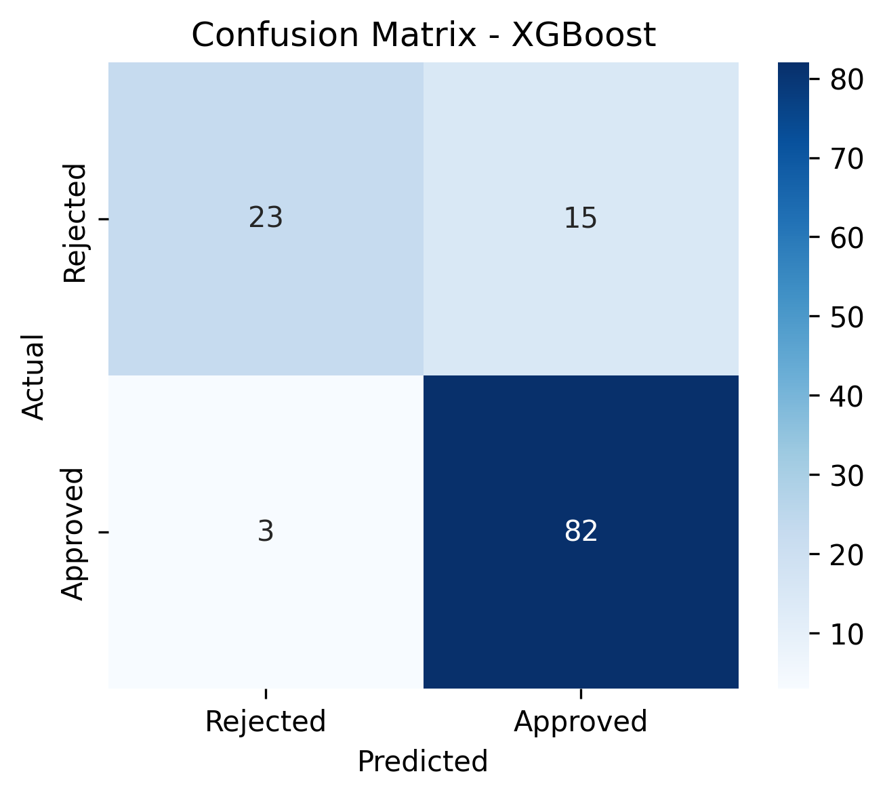

# 🏦 Loan Approval Prediction using Machine Learning

## 📌 Project Overview

This project builds an end-to-end **Machine Learning classification system** to predict whether a loan application will be **approved or rejected** based on applicant financial and demographic information.

The project simulates a real-world banking scenario where predictive models help financial institutions reduce risk and improve loan approval decisions.

---

## 🎯 Problem Statement

Financial institutions need to assess loan applications efficiently while minimizing financial risk.

This project predicts:

* `1` → Loan Approved
* `0` → Loan Rejected

It is a **binary classification problem** focused on identifying eligible applicants while controlling risky approvals.

---

## 📂 Dataset Description

The dataset was sourced from Kaggle and contains **614 loan application records** with demographic and financial attributes.

### 🔑 Key Features

* **ApplicantIncome** – Income of the applicant
* **CoapplicantIncome** – Income of co-applicant
* **LoanAmount** – Requested loan amount
* **Credit_History** – Credit repayment history
* **Gender, Education, Property_Area** – Demographic attributes

---

## 🛠️ Tech Stack

### Programming Language
* Python

### Libraries Used
* Pandas, NumPy → Data Processing
* Matplotlib, Seaborn → Data Visualization
* Scikit-learn → Machine Learning & Evaluation
* XGBoost → Final Model

---

## 🔍 Methodology

### 1️⃣ Data Preprocessing

* Handled missing values using statistical methods
* Encoded categorical variables using Label Encoding
* Removed irrelevant features such as `Loan_ID`

---

### 2️⃣ Exploratory Data Analysis (EDA)

* Analyzed feature distributions
* Explored relationships between features and loan approval status
* Identified important predictive variables

---

### 3️⃣ Model Development

Multiple Machine Learning models were trained and compared:

* Logistic Regression
* Random Forest
* Gradient Boosting
* **XGBoost (Best Performing Model)** ✅

---

### 4️⃣ Model Evaluation

Models were evaluated using:

* Accuracy Score
* Macro F1-Score
* Classification Report
* Confusion Matrix
* Stratified K-Fold Cross Validation

---

### 5️⃣ Cross Validation

To ensure model stability and generalization, **5-Fold Stratified Cross Validation** was used during evaluation.

---

## 🏆 Final Model

### XGBoost Classifier

```python
XGBClassifier(
    n_estimators=150,
    max_depth=3,
    learning_rate=0.05,
    subsample=0.8,
    colsample_bytree=0.8,
    eval_metric='logloss',
    random_state=42
)
```

---

## 📊 Model Performance

| Metric | Score |
|---|---|
| Test Accuracy | **0.85** |
| Test Macro F1 Score | **0.81** |
| Cross-Validation Macro F1 | **0.71** |

---

## 📌 Classification Report

### Class 0 (Rejected)

* Precision = 0.88
* Recall = 0.61
* F1-Score = 0.72

### Class 1 (Approved)

* Precision = 0.85
* Recall = 0.96
* F1-Score = 0.90

---

## 📊 Confusion Matrix



---

## 📊 Confusion Matrix Interpretation

The confusion matrix provides detailed insight into model predictions:

* **True Positives (TP):** Eligible applicants correctly approved
* **True Negatives (TN):** Risky applicants correctly rejected
* **False Positives (FP):** Risky applicants incorrectly approved
* **False Negatives (FN):** Eligible applicants incorrectly rejected

---

## 🔎 Business Impact

Different prediction errors have different business consequences:

### ⚠️ False Positives

Approving risky applicants may lead to financial loss for the bank.

### ⚠️ False Negatives

Rejecting eligible applicants may reduce customer satisfaction and business opportunities.

---

## ⚖️ Model Behavior Insight

* The model achieves high recall for approved loans
* Most eligible applicants are correctly identified
* Some risky applicants may still be approved
* The model shows a slight bias toward approving loans, which may be acceptable depending on business objectives

---

## 📈 Key Insights

* XGBoost outperformed all other models
* Tree-based models handled feature interactions effectively
* Credit history was a major factor in loan approval prediction
* Cross-validation improved evaluation reliability
* Macro F1-score helped evaluate performance fairly across both classes

---

## ⚠️ Challenges Faced

* Small dataset size
* Slight class imbalance
* Bias toward majority approval class

---

## 💡 Conclusion

After comparing multiple Machine Learning models, **XGBoost achieved the best balance between accuracy, recall, and overall classification performance**.

This project demonstrates a complete Machine Learning workflow including:

* Data preprocessing
* Exploratory Data Analysis
* Model training
* Cross-validation
* Performance evaluation

---

## 👤 Author

**Keerthi**

🔗 GitHub: [allianceprokeerthi-cmd](https://github.com/allianceprokeerthi-cmd)
